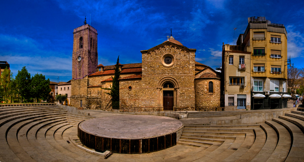

# Neural-Algorithm-for-Artistic-Style
Neural Algorithm for Artistic Style


## Usage

The implementation can be found in the IPython Notebook. 

Models can be downloaded as follows:
 
```
cd models
./get_models -m vgg
```

## Dependencies
To use the script it is needed:

* Tensorflow
* Numpy & Scipy
* PIL

## Source Code 
1- alexnet.py - implementation of AlexNet deep learning network
2-vgg.py - implementation of VGG 16 deep learning network 

## Examples



